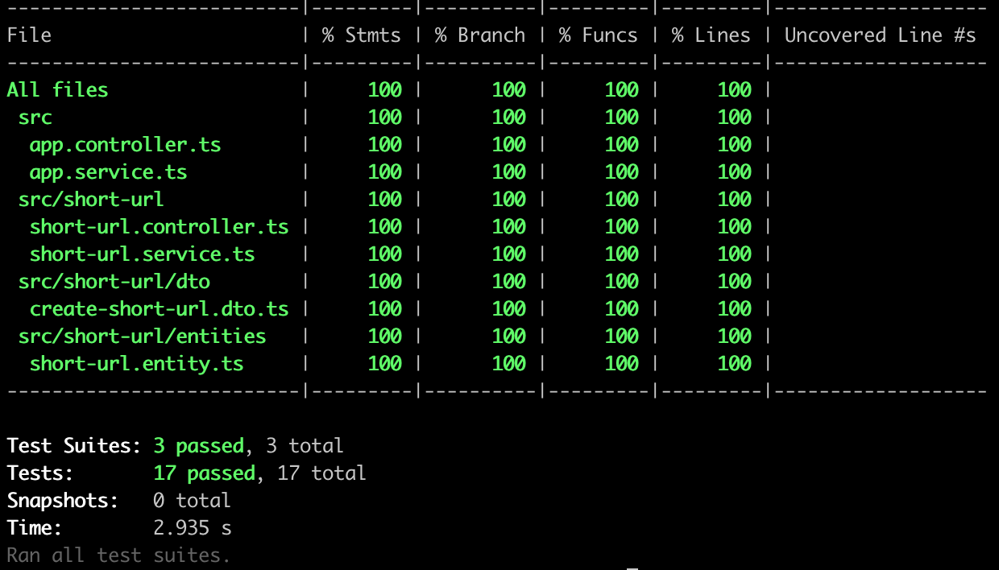
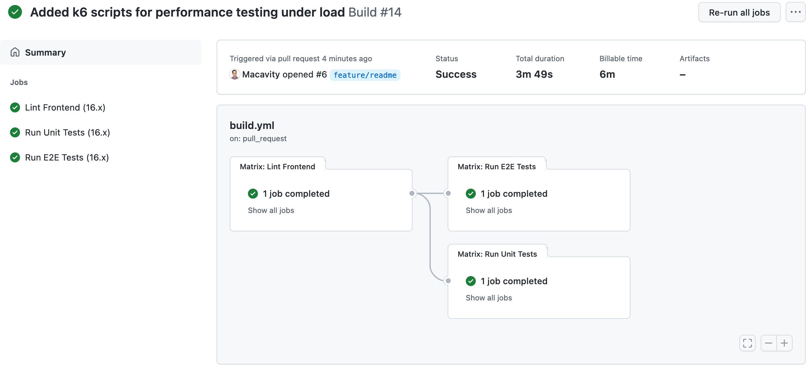

# URL Shortener

### Task Summary

- ✅ Implement assignment using:
    - ✅ Language: **Node**
    - ✅ Framework: **NestJS**
    - ✅ Two endpoints are required
        - ✅ /short-url/encode - Encodes a URL to a shortened URL
        - ✅ /short-url/decode - Decodes a shortened URL to its original URL.
    - ✅ Both endpoints should return JSON
- ✅ There is no restriction on how your encode/decode algorithm should work. You just need to make sure that a URL can be 
  encoded to a short URL and the short URL can be decoded to the original URL. 
  **You do not need to persist short URLs to a database. Keep them in memory.**
- ✅ Provide detailed instructions on how to run your assignment in a separate markdown file
- ✅ Provide API tests for both endpoints

## How to use

```bash
$ npm install
$ npm run start
```

After the local server is running you can:

- View the [local server](http://localhost:3000/)
- View the [API Documentation](http://localhost:3000/docs/)

## List of notable npm scripts

```bash
# Run unit tests
$ npm run test:unit

# Show test coverage
$ npm run test:cov

# Lint the code
$ npm run lint

# Open Cypress to allow triggering the E2E test suites
$ npm run test:e2e

# Run all E2E tests in headless mode
$ npm run test:e2e:ci
```

## How to run the Load Tests

I used K6 for the load tests, please refer to the [Official Documentation](https://k6.io/docs/getting-started/installation/) to find out how to install it on your system.

For Mac with Homebrew this is enough:
```bash
brew install k6
```

Given you use a Mac, afterwards you can run these tests
```bash
# Test Frontend, Encode and Decode Endpoints
npm run load-test:all

# The decode endpoint suffers the most from heavy load, so I added another one specifically to ramp up load
npm run load-test:decode
```

## Screenshots

### Frontend


### Test Coverage


### Result of E2E Test Suites


### Result of running `npm run load-test:all`

Obviously the numbers highly depend on the used machine.


### Github Workflow

To ensure every merged feature branch during development doesn't break something
I created a github workflow.


